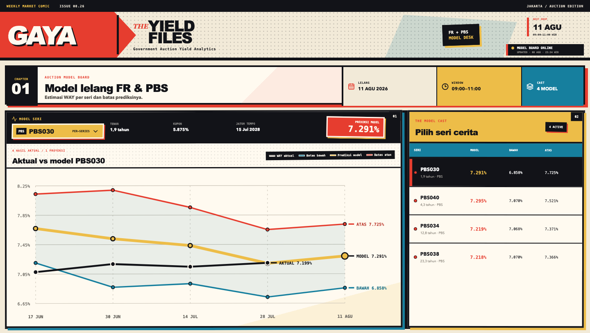

<div align="center">

# GAYA

### Government Auction Yield Analytics

An interactive model board for Indonesia's weekly FR and PBS government bond auctions.

[**Open the live dashboard →**](https://gaya.mohammad-raffy.workers.dev/)

</div>



## The board

GAYA turns the next government bond auction into a compact, series-level view. Select an FR or PBS series to compare awarded weighted-average yield (`WAY`) history against the model path and its published lower and upper bounds.

The dashboard shows:

- the instruments listed for the upcoming DJPPR auction;
- one independently fitted model for each eligible bond series;
- historical actual WAY versus the corresponding backtest prediction;
- the next prediction with lower and upper bounds;
- coupon, remaining tenor, maturity date, and auction window.

## Weekly data flow

```text
Monday 08:15 WIB
DJPPR auction plan → eligible FR/PBS universe

Tuesday 09:05 WIB
market snapshot → auction history refresh → model fit per series
       → sanitized predictions.json → GAYA → Cloudflare deploy
```

The private pipeline performs scraping, validation, feature construction, model fitting, and diagnostics. This public repository is deliberately limited to the presentation layer and a sanitized prediction feed.

| Public in this repository | Kept private |
| --- | --- |
| Series and instrument metadata | Training dataset |
| Actual WAY history | Model coefficients and diagnostics |
| Prediction and published bounds | Market feature inputs |
| Auction and update timestamps | Scraping infrastructure |

If a scheduled auction is unavailable or a series does not have enough observations, the last valid public release remains in place.

## Model coverage

- Supported families: `FR` and `PBS`.
- Estimation: one model per bond code, never one pooled model for every series.
- Public chart: four historical backtest points plus the next auction projection.
- Other auction instruments such as `SPN`, `SPNS`, and `PBSG` are not published by the model board.

## Stack

```text
React · TypeScript · Vite · SVG
GitHub Actions · Cloudflare
```

The chart is rendered directly as SVG. The application has no login, browser-side model, hidden API key, or user input form.

## Run locally

```bash
git clone https://github.com/zzeiidann/GAYA.git
cd GAYA
npm install
npm run dev
```

Production check:

```bash
npm run build
npm run preview
```

The frontend reads [`public/data/predictions.json`](public/data/predictions.json). When the private Tuesday workflow publishes a new version of that file, Cloudflare automatically rebuilds the production branch.

## Deployment

Production is served by Cloudflare from the `main` branch:

**[gaya.mohammad-raffy.workers.dev](https://gaya.mohammad-raffy.workers.dev/)**

```text
Build command : npm run build
Output         : dist
```

No frontend environment variable is required.

---

GAYA provides statistical estimates for research and monitoring. It is not an investment recommendation.
