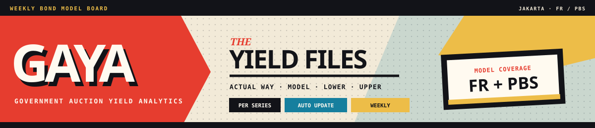
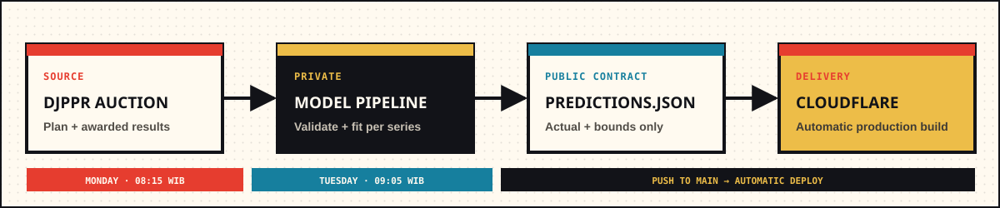

<p align="center">
  
</p>

<p align="center">
  <a href="https://gaya.mohammad-raffy.workers.dev/"></a>
  
  
</p>

<p align="center">
  <strong>Government Auction Yield Analytics for Indonesia's FR and PBS bond market.</strong><br />
  A weekly decision-support dashboard combining awarded yield history, independently fitted per-series projections, and published prediction bounds in one focused desktop view.
</p>


## Dashboard

GAYA turns the next government bond auction into a compact, series-level view. Select an FR or PBS series to compare awarded weighted-average yield (`WAY`) history against the model path and its published lower and upper bounds.

The dashboard shows:

- the instruments listed for the upcoming DJPPR auction;
- one independently fitted model for each eligible bond series;
- historical actual WAY versus the corresponding backtest prediction;
- the next prediction with lower and upper bounds;
- coupon, remaining tenor, maturity date, and auction window.

### Reading the chart

| Series | Meaning |
| --- | --- |
|  | Awarded weighted-average yield published for the historical auction. |
|  | Backtest estimate for historical dates and projection for the next auction. |
|  | Published lower prediction bound. |
|  | Published upper prediction bound. |

## Weekly data flow



The private pipeline performs scraping, validation, feature construction, model fitting, and diagnostics. This public repository is deliberately limited to the presentation layer and a sanitized prediction feed.

| Public in this repository | Kept private |
| --- | --- |
| Series and instrument metadata | Training dataset |
| Actual WAY history | Model coefficients and diagnostics |
| Prediction and published bounds | Market feature inputs |
| Auction and update timestamps | Scraping infrastructure |

If a scheduled auction is unavailable or a series does not have enough observations, the last valid public release remains in place.

## Model coverage

| | Coverage |
| --- | --- |
|  | Fixed-rate SUN and Project Based Sukuk series selected from the current auction plan. |
|  | One independently fitted model per eligible bond code, never a pooled model across every series. |
|  | Four historical backtest observations followed by the next auction projection. |

`SPN`, `SPNS`, and `PBSG` instruments are intentionally excluded from the public model board.

## Stack

<table>
  <tr>
    <td width="25%" align="center">
      <br /><br />
      Component-based dashboard and model selector.
    </td>
    <td width="25%" align="center">
      <br /><br />
      Typed public payload and series metadata.
    </td>
    <td width="25%" align="center">
      <br /><br />
      Fast local development and production bundles.
    </td>
    <td width="25%" align="center">
      <br /><br />
      Dependency-free chart rendering and labels.
    </td>
  </tr>
  <tr>
    <td colspan="2" align="center">
      <br /><br />
      Receives the sanitized release produced by the private weekly workflow.
    </td>
    <td colspan="2" align="center">
      <br /><br />
      Rebuilds and serves the production dashboard after every release commit.
    </td>
  </tr>
</table>

The public application has no login, browser-side model, secret key, or user input form. It reads a sanitized release from [`public/data/predictions.json`](public/data/predictions.json); model fitting and sensitive inputs remain in the private pipeline.

## Deployment

Production is served by Cloudflare from the `main` branch:

**[gaya.mohammad-raffy.workers.dev](https://gaya.mohammad-raffy.workers.dev/)**

```text
Build command : npm run build
Output         : dist
```

No frontend environment variable is required.

---

GAYA provides statistical estimates for research and monitoring. It is not an investment recommendation.
