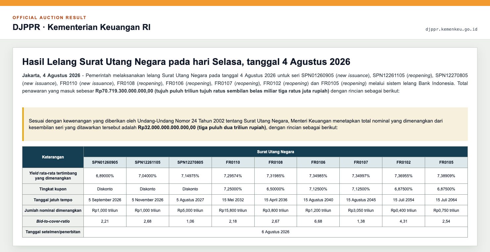

<p align="center">
  
</p>

<p align="center">
  <a href="https://gaya.mohammad-raffy.workers.dev/"></a>
  
  
  
</p>

<p align="center">
  <strong>GAYA stands for Government Auction Yield Analytics.</strong><br />
  An automated analytics system for Indonesia's FR and PBS bond auctions, combining a private per-series machine-learning engine, weekly data orchestration, and a continuously deployed public dashboard.
</p>


## Dashboard

GAYA turns the next government bond auction into a compact, series-level view. Select an FR or PBS series to compare awarded weighted-average yield (`WAY`) history against the model path and its published lower and upper bounds.

The dashboard shows:

- the instruments listed for the upcoming DJPPR auction;
- one independently fitted model for each eligible bond series;
- historical actual WAY versus the corresponding backtest prediction;
- the next prediction with lower and upper bounds;
- coupon, remaining tenor, maturity date, and auction window.

## Official data source

Auction coverage and realized yields are anchored to announcements published by the Directorate General of Budget Financing and Risk Management (`DJPPR`), Ministry of Finance of the Republic of Indonesia. The source is kept visible so every series, auction date, and realized `WAY` shown by GAYA can be traced back to an official release.

<p align="center">
  <a href="https://djppr.kemenkeu.go.id/hasillelangsuratutangnegarapadahariselasa,tanggal4agustus2026">
    
  </a>
</p>

<p align="center">
  <sub>Direct screenshot of the official DJPPR auction-result announcement, captured in Mozilla Firefox on 9 August 2026. Click the image to open the source page.</sub>
</p>

| Official publication | Role in GAYA |
| --- | --- |
| `Rencana Lelang` | Establishes the upcoming auction date, settlement date, eligible series, coupon, and maturity. |
| `Hasil Lelang` | Supplies realized weighted-average yield, awarded nominal, incoming bids, and bid-to-cover for historical observations. |
| Public GAYA release | Exposes only the auction context, actual history, model projection, and published bounds required by the dashboard. |

## Reading the chart

| Series | Meaning |
| --- | --- |
|  | Awarded weighted-average yield published for the historical auction. |
|  | Backtest estimate for historical dates and projection for the next auction. |
|  | Published lower prediction bound. |
|  | Published upper prediction bound. |

## GAYA Engine

The dashboard is the delivery surface; the **GAYA Engine** is the private machine-learning computation layer behind it. Every auction cycle is rebuilt from source data, evaluated per eligible bond series, and passed through a release gate before any public artifact is produced.


| Engine stage | Responsibility | Exposure |
| --- | --- | --- |
| Auction intake | Resolve the next auction, settlement schedule, and eligible FR/PBS universe from official publications. | Private |
| Data layer | Assemble and validate model-ready histories and contextual inputs for each series. | Private |
| Per-series ML forecasting | Fit, evaluate, and generate an independent projection for every eligible bond code. | Private |
| Release gate | Check observation sufficiency, output validity, and diagnostics; retain the last valid release when a run is not publishable. | Private |
| Prediction contract | Serialize only display-ready actuals, projections, bounds, instrument metadata, and timestamps. | Public |

> **Model boundary:** no training dataset, feature recipe, fitted parameter, diagnostic output, serialized model, or callable inference code is shipped to the browser. The public application receives only the sanitized prediction contract. Client-side C++, WebAssembly, and minification are not treated as model protection because browser-delivered code remains inspectable.

If a scheduled auction is unavailable or a series does not have enough observations, the last valid public release remains in place.

## Model coverage

| | Coverage |
| --- | --- |
|  | Fixed-rate SUN and Project Based Sukuk series selected from the current auction plan. |
|  | One independently fitted model per eligible bond code, never a pooled model across every series. |
|  | Four historical backtest observations followed by the next auction projection. |

`SPN`, `SPNS`, and `PBSG` instruments are intentionally excluded from the public model board.

## System stack

<table>
  <tr>
    <td width="33%" align="center">
      <br /><br />
      Private ingestion, validation, forecasting, and release pipeline.
    </td>
    <td width="33%" align="center">
      <br /><br />
      Historical assembly, schema checks, and model-ready series data.
    </td>
    <td width="33%" align="center">
      <br /><br />
      Monday intake, Tuesday model refresh, validation, and publication.
    </td>
  </tr>
  <tr>
    <td width="33%" align="center">
      <br /><br />
      Typed public contract, model selector, and analytics interface.
    </td>
    <td width="33%" align="center">
      <br /><br />
      Production bundle and dependency-free chart rendering.
    </td>
    <td width="33%" align="center">
      <br /><br />
      Continuous build and global delivery after every public release.
    </td>
  </tr>
</table>

The public application has no login, browser-side model, secret key, or user input form. It reads a sanitized release from [`public/data/predictions.json`](public/data/predictions.json); model fitting and sensitive inputs remain in the private pipeline.

## Deployment

Production is served by Cloudflare from the `main` branch:

**[gaya.mohammad-raffy.workers.dev](https://gaya.mohammad-raffy.workers.dev/)**

```text
Build command : npm run build
Output         : dist
```

No frontend environment variable is required.

---

GAYA provides statistical estimates for research and monitoring. It is not an investment recommendation.
